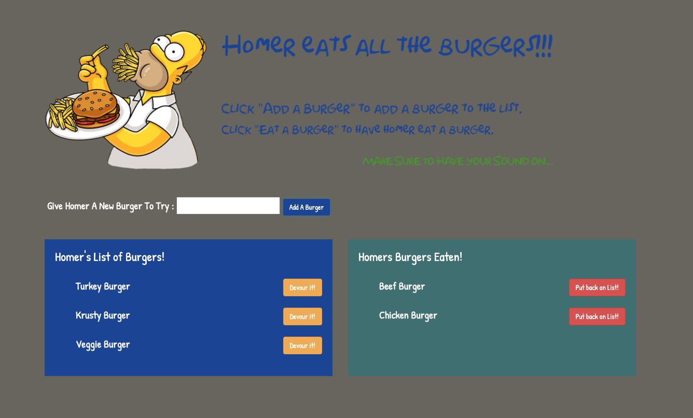

# **Homer Eats the Burgers**

## Description 
Homer is hungry and wants you to give him suggestions of burgers to eat.  You can submit a new burger and it will be added to the list of burgers for him to eat.  Press "Devour" and it will move over to the eaten burgers section.  Want to add back a burger he has eaten and have him eat another one, don't worry just put the burger back on the list.  Also, don't forget to check out the custom favicon and sounds.
## Screenshots

## Table of contents
- [Description](#Description)
- [Installation](#Installation)
- [Licence](#Licence)
- [Repository Link](#Repository)
- [Diployed App Info](#App) 
- [GitHub Info](#GitHub) 
## Licence
MIT
## Repository
- [Eat the Burger](https://github.com/Meddle74/burger)

## App
- [Eat the Burger App on Heroku](https://intense-escarpment-25565.herokuapp.com/)
## GitHub
- Email: jpatricklloyd@gmail.com
- [GitHub Profile](https://github.com/Meddle74)